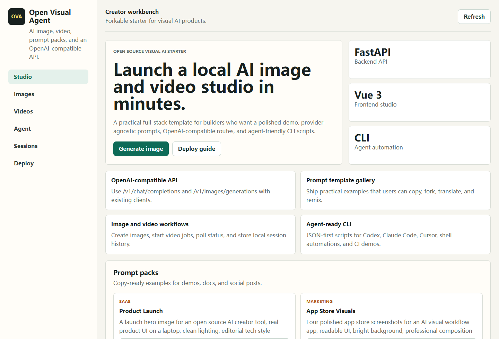

# Open Visual Agent

[中文说明](./README.cn.md)

> Forkable AI image and video studio with prompt packs, OpenAI-compatible API, and agent-ready CLI scripts.

    

## Showcase



## Highlights

- python
- fastapi
- vue
- ai image
- openai compatible
- Practical project structure for learning, demos, and remixing.
- Local-first setup where secrets, generated files, and build output stay out of Git.

## Quick Start

```bash
setup_env.bat
start_all.bat
```

## Project Structure

```text
.
|-- src/ or app/          Main source code
|-- public/ or assets/    Static assets when available
|-- docs/                 Screenshots, notes, or deployment docs
|-- README.md             GitHub landing README
|-- README.en.md          English documentation
`-- README.cn.md          Chinese documentation
```

## Roadmap

- [ ] Add more real-world examples and screenshots.
- [ ] Expand tests or smoke checks for the primary workflow.
- [ ] Publish clean release artifacts where the project type supports it.
- [ ] Keep documentation friendly for new contributors.

## Contributing

Issues and pull requests are welcome. Useful contributions include screenshots, demos, docs, templates, presets, compatibility fixes, tests, and translations.

If this project helps you, a star and fork make it easier for more people to discover it.
