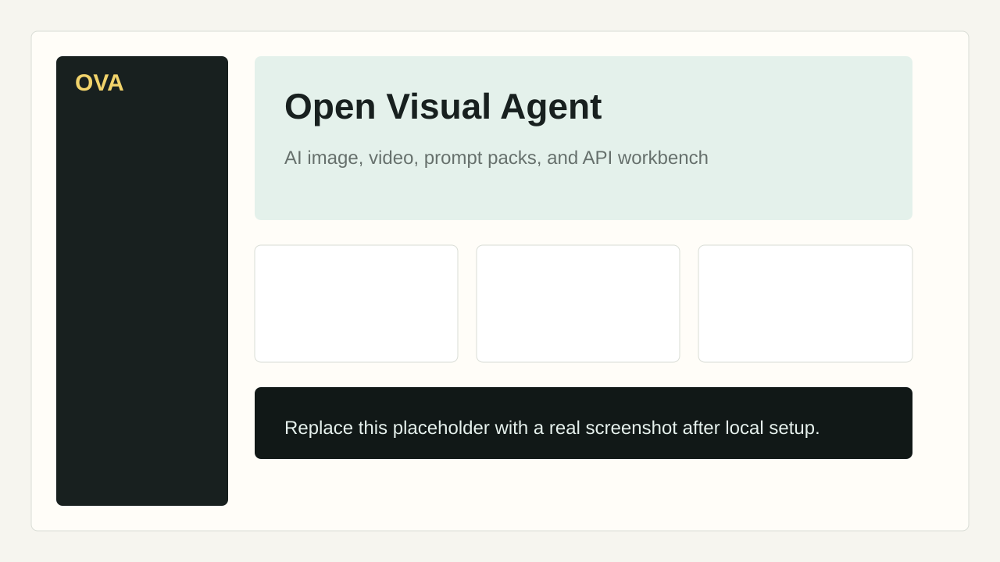

# Open Visual Agent

> A forkable AI image and video studio with prompt packs, an OpenAI-compatible API, and agent-ready CLI scripts.

[](https://github.com/Kala9527/open-visual-agent/actions/workflows/ci.yml)
[](LICENSE)
[](https://fastapi.tiangolo.com/)
[](https://vuejs.org/)

Open Visual Agent helps builders ship a polished visual AI product fast: image generation, video tasks, prompt templates, local session history, OpenAI-compatible routes, and JSON-first CLI scripts for AI coding agents.



## Why Star This

- **Ready-to-fork full stack**: FastAPI backend, Vue 3 studio, Docker, CI, docs, and templates.
- **OpenAI-compatible**: expose `/v1/chat/completions`, `/v1/models`, and `/v1/images/generations`.
- **Visual growth prompt pack**: practical prompts for launch pages, thumbnails, app screenshots, and video keyframes.
- **Agent-friendly CLI**: scripts return structured JSON for Codex, Claude Code, Cursor, shell automation, and demos.
- **No large files or secrets**: `.env`, generated media, databases, and build artifacts are ignored by default.

## Quick Start

```bat
git clone https://github.com/Kala9527/open-visual-agent.git
cd open-visual-agent
copy .env.example .env
setup_env.bat
start.bat
```

In another terminal:

```bat
cd frontend
npm install
npm run dev
```

Open:

- Web studio: http://127.0.0.1:5177
- API docs: http://127.0.0.1:8007/docs

## Docker

```bash
cp .env.example .env
docker compose up --build
```

Then open http://127.0.0.1:5177.

## Configure Providers

Edit `.env`:

```dotenv
AGNES_TEXT_API_KEY=YOUR_TEXT_PROVIDER_API_KEY
AGNES_TEXT_API_BASE_URL=https://apihub.agnes-ai.com/v1
AGNES_TEXT_MODEL=agnes-2.0-flash

AGNES_IMAGE_API_KEY=YOUR_IMAGE_PROVIDER_API_KEY
AGNES_IMAGE_API_BASE_URL=https://apihub.agnes-ai.com/v1
AGNES_IMAGE_MODEL=agnes-image-2.1-flash

AGNES_VIDEO_API_KEY=YOUR_VIDEO_PROVIDER_API_KEY
AGNES_VIDEO_API_BASE_URL=https://apihub.agnes-ai.com/v1
AGNES_VIDEO_MODEL=agnes-video-v2.0
```

`.env` is ignored by Git. Do not commit real keys.

## Features

| Feature | What it does |
| --- | --- |
| Image studio | Generate images, pass reference image URLs, download outputs, and inspect raw provider results. |
| Video task runner | Create text-to-video, image-to-video, and keyframe tasks, then poll status. |
| Prompt packs | Copy practical launch, SaaS, thumbnail, app screenshot, and keyframe prompts. |
| Agent scenarios | Growth marketer, creative director, developer advocate, and default creative copilot modes. |
| OpenAI-compatible API | Use existing SDKs and tools against the local `/v1` API. |
| CLI scripts | JSON-first commands for image, video, text generation, and video status checks. |
| Local history | SQLite session and media output records for repeatable demos. |

## CLI Examples

```bat
agent_cli_scripts\generate_text.bat --prompt "Write 5 launch hooks for an AI image app" --pretty
agent_cli_scripts\generate_image.bat --prompt "A clean product render of an AI image studio" --size 1024x1024 --pretty
agent_cli_scripts\generate_video.bat --prompt "A smooth camera move across a creator dashboard" --pretty
agent_cli_scripts\video_status.bat --task-id TASK_ID --download --pretty
```

## OpenAI-Compatible Usage

```text
Base URL: http://127.0.0.1:8007/v1
Chat Completions: /chat/completions
Models: /models
Images: /images/generations
API Key: any placeholder value for local use
```

## Project Structure

```text
open-visual-agent/
  backend/              FastAPI routes, provider services, SQLite storage
  frontend/             Vue 3 + TypeScript visual studio
  prompts/              Copy-ready visual growth prompt packs
  agent_cli_scripts/    JSON-first scripts for AI agents and automation
  scripts/              Human CLI helpers
  src/                  Compatibility package exports
  docs/                 API and deployment docs
```

## Open Source Packaging Checklist

- [x] One-command local setup
- [x] Docker Compose deployment
- [x] GitHub Actions CI
- [x] Prompt pack included
- [x] Issue templates
- [x] MIT license
- [x] `.gitignore` blocks secrets, generated media, databases, and build output

## Comparison

| Project type | Open Visual Agent |
| --- | --- |
| Simple prompt list | Adds a real working studio and API. |
| Single-provider image UI | Keeps text, image, and video provider config separate. |
| Internal demo app | Ships docs, Docker, CI, templates, and contribution paths. |
| Closed SaaS | Runs locally and can be forked, modified, and self-hosted. |

## Roadmap

- Provider presets for OpenAI, Replicate, SiliconFlow, Volcengine, and custom OpenAI-compatible gateways.
- MCP server wrapper for image and video generation.
- Prompt pack marketplace format.
- Gallery view for generated assets.
- Hosted demo screenshots and example outputs.
- Tests for provider response parsing and video polling.

## Contributing

PRs are welcome. Good first contributions include prompt packs, provider setup guides, gallery UI, tests, and deployment recipes.

See [CONTRIBUTING.md](CONTRIBUTING.md).

## Deployment Notes

See [docs/DEPLOYMENT.md](docs/DEPLOYMENT.md).

Do not deploy with placeholder API keys. In production, store keys as environment variables or platform secrets, and persist only `outputs/` and the SQLite database if you need history.

## License

MIT
